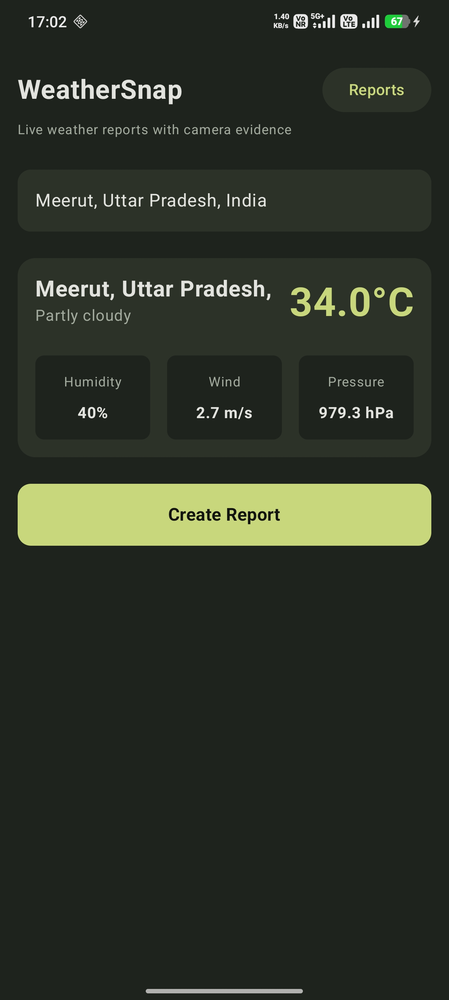
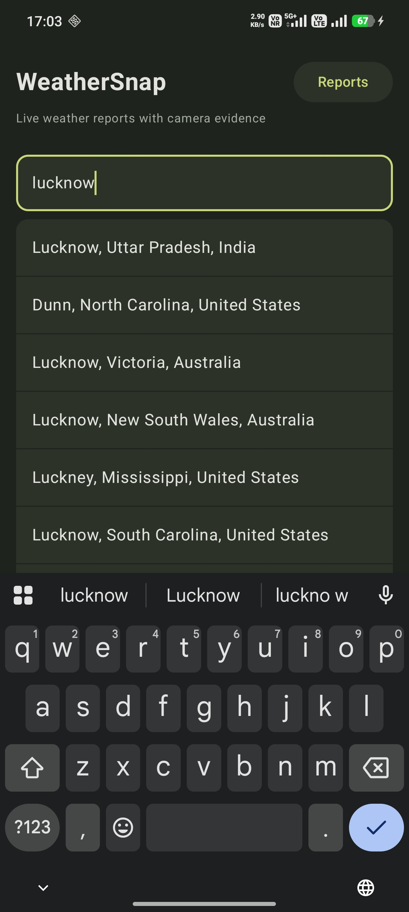
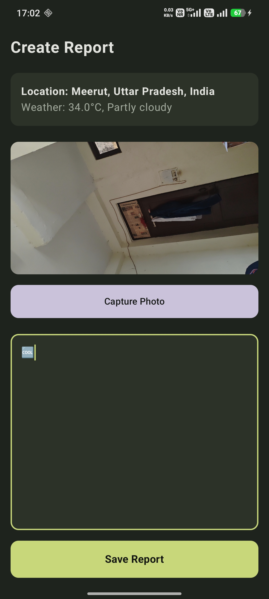
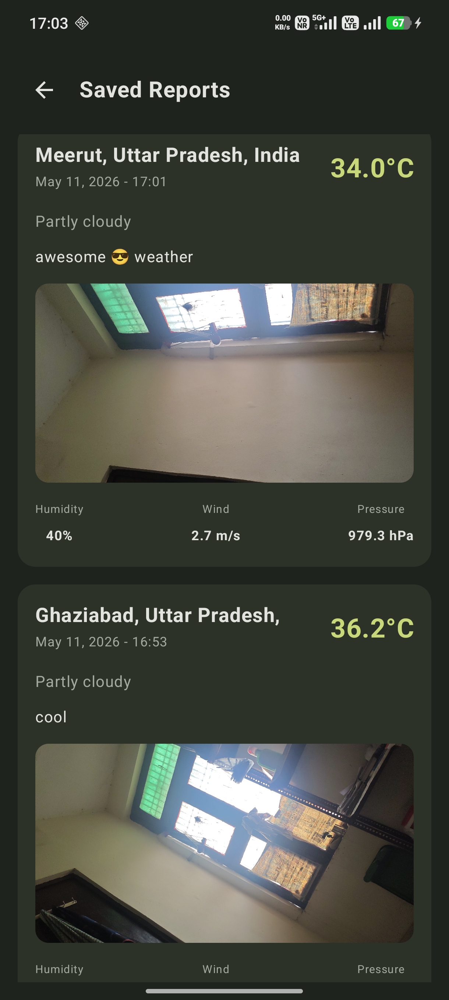

# WeatherSnap ☁️📸

WeatherSnap is a modern Android weather reporting application built using Kotlin and Jetpack Compose.

The app allows users to search live weather data, capture camera evidence, and save weather reports locally using Room Database.

---

# ✨ Features

- 🔍 Real-time weather search
- 🌍 City suggestions and autocomplete
- 🌡️ Live weather details
- 📸 Camera integration for evidence capture
- 💾 Save reports locally using Room Database
- 🗂️ Saved reports history screen
- 🎨 Modern premium dark green UI
- 📱 Fully built with Jetpack Compose
- 🔄 Persistent last searched city

---

# 📱 Screenshots

<p align="center">
  
  
  
  
</p>

<p align="center">
  <b>Home Screen</b> &nbsp;&nbsp;&nbsp;&nbsp;
  <b>City Suggestions</b> &nbsp;&nbsp;&nbsp;&nbsp;
  <b>Create Report</b> &nbsp;&nbsp;&nbsp;&nbsp;
  <b>Saved Reports</b>
</p>

---

# 🛠️ Tech Stack

- Kotlin
- Jetpack Compose
- MVVM Architecture
- Repository Pattern
- Room Database
- Retrofit
- Hilt Dependency Injection
- Navigation Compose
- Coil
- Coroutines & Flow

---

# 🏗️ Architecture

The project follows MVVM Architecture with clean separation of concerns:

- Presentation Layer
- Domain Layer
- Repository Layer
- Local Database Layer
- Remote API Layer

---

# 📂 Project Structure

```text
app/
 ├── data
 ├── domain
 ├── presentation
 ├── ui
 ├── database
 ├── repository
 └── utils
```

---

# 🚀 How to Run

### 1. Clone the repository

```bash
git clone https://github.com/programmer-kunal/WeatherSnap.git
```

### 2. Open project in Android Studio

### 3. Sync Gradle

### 4. Run the app on emulator or physical device

---

# 🔮 Future Improvements

- Weather forecast support
- Google Maps integration
- Cloud sync
- Report sharing
- Offline weather caching
- Better analytics dashboard

---

# 👨‍💻 Developer

### Kunal

GitHub:
https://github.com/programmer-kunal

---
